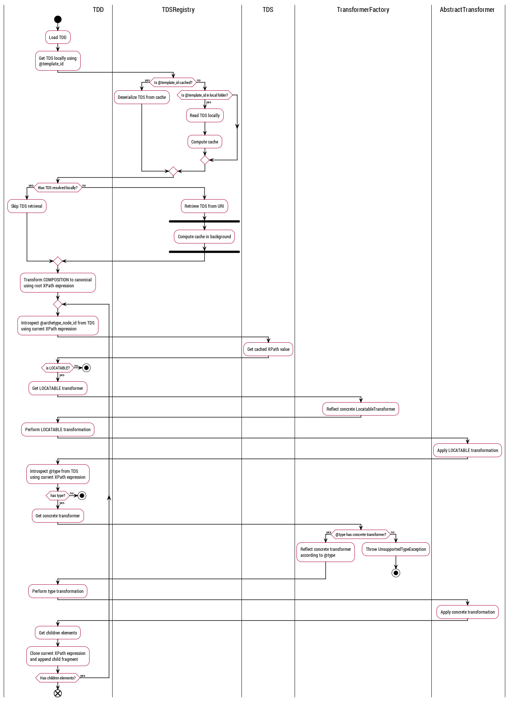
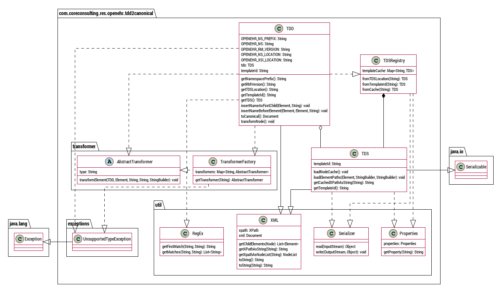

# openEHR-TDD2canonical

This repository provides a *work in progress* solution to convert openEHR compositions serialized as TDD (*Template
 Data Document*) to canonical XML, so that they comply to the Reference Model (see
 [Composition.xsd](./src/test/resources/RM/XML-schemas/Composition.xsd)). It was first based on the original code by
  [Ricardo Gonçalves](mailto:ricardofago@gmail.com) @ 
  [Core Consulting (Brasília, Brazil)](http://coreconsulting.com.br).

## Introduction

The TDD is a format used to serialize openEHR compositions using XML documents that are instances of a XML schema
known as TDS (*Template Data Schema*). It enforces all restrictions specified within a template and its archetypes,
flattening the information model into a complete definition to replace archetype node ids, classes and paths with a
more readable syntax intended to make it meaningful for developers with low exposure to the openEHR formalism.

As the TDD is generated from a TDS, it complies to a specific template. However, many openEHR solutions currently
support canonical JSON and XML instances of the Reference Model, which, albeit more generic, is a vocabulary that
requires deeper knowledge about the openEHR formalism. The goal for this project is to act a bridge, allowing parties
capable of handling TDD with standard tooling to interact with such solutions.

Assuming Ocean's [Templeate Designer](https://oceanhealthsystems.com/products/template-designer) to be, historically,
the *de facto* community modelling tool for openEHR template maintainers, we expect the TDD to comply to a TDS instance
that was generated using the transformation shipped with it (see ``./Transforms/tds-default.xsl`` from the installation
 directory).  

## Architecture

The idea behind the TDD to canonical transformation is pretty simple. We traverse the TDD document recursively and
perform any required transformations on the nodes we visit. Due to the complexity and legacy nature of 
``tds-default.xsl``, currently the gap between the TDD and the canonical formats is being identified by manually
comparing composition instances from local use cases (*e.g.* TDSs being used in Brazil), so we can cover the relevant
scenarios sooner, and once we reach an element that we can't transform we throw an exception in order to quickly
identify it. As not all elements require transformation, it is possible to relax this at a more mature stage.
 
At most cases, as some important identifiers are optional from the TDS definition, we need to introspect metadata when
transforming a TDD element to its canonical form. This is done using a XPath composite that is built recursively with
the tree traversal, pointing to its definition in the TDS.

Considering that the amount of look up operations that may happen during the transformation of a composition, there
is a mechanism to store TDSs locally, preload their reachable XPath composites once, index the object in an in-memory
registry and serialize it to the disk, which drastically improves de algorithm execution time.

As for the transformation of specific types according to the openEHR Reference Model, it is the major extensibility
point for this solution. The actual logic is exposed from an abstract class, and the actual transformers implement
it and are provided through a factory indexed by the type name. Feel free to create an issue if you reach any
unsupported type (be sure to provide the TDD and its TDS), or even better, to raise a pull request sharing your
contribution to the current solution.

### Activity diagram

The diagram below introduces a more detailed flow of the transformation logic. It doesn't cover all the invocation
stack, specially for utility classes (RegEx, XPath, serialization, etc.), but it provides a comprehensible overview
 of the business logic.

The [source](./uml/Flow.plantuml) was written and processed used [PlantUML](http://plantuml.com/).

Even though the activity diagram implies preorder traversal for clarity, the actual code implements postorder
 traversal, so
 that the transformation of a node doesn't interfere with its ancestors' paths.

### Class diagram

The diagram below shows the class definitions and relationships. More details are available in the
[JavaDoc](https://ricardofago.github.io/openEHR-TDD2canonical/docs). Be noted that the concrete transformers that
are instances of ``AbstractTransformer`` are not represented, as they are abstracted to the transformation caller
(``TDD.transformNode(Node, StringBuilder)``), and they may include additional fields or methods internally if
 appropriate.

The [source](./uml/Flow.plantuml) was written and processed used [PlantUML](http://plantuml.com/).

## Getting started
Let's start with a few notes about the project:
* Maven (this is a Maven project, we use JUnit 5 to coordinate and assert the transformation)
* Logging (we use Log4j2 with asynchronous logging and lambdas to reduce the overhead)
  * About the logging levels, select the one that suits the expected interactivity/verbosity:
  
Level|Description
-----|----------
FATAL|Only logs unrecoverable events, from which the solution is expected to abort
ERROR|Includes problematic events that impact the execution but may not abort it
WARN|Includes undesirable events, from which the solution is expected to recover
INFO|Includes relevant events and states from the execution flow
DEBUG|Includes relevant events and states for debugging purposes
TRACE|Includes all the method invocations and execution stack

Make sure to specify the properties
``-DLog4jContextSelector=org.apache.logging.log4j.core.async.AsyncLoggerContextSelector`` and 
``-Dorg.apache.logging.log4j.level=DEBUG`` (or other level) to properly set the logging configurations. 

You can run
``mvn test``
to perform all tests or
``mvn test -Dtest=TDDTest# transformed_RAC_doc1_is_valid``
to perform the test currently available, which is the major transformation driving the development from the use case in
Brazil.

Please note that at the moment the test ``transformed_RAC_doc1_is_valid`` fails, not because of the transformation
itself, but instead because the standard XML schema validation library shipped with the JVM misinterprets the XSI
abstractions (xsi:type, xsi:schemaLocation), but the resulting composition can be successfully validated with more
capable tools.

## Extensions and optimizations

In this section we shortly introduce how to extend and optimize the solution.

### Properties

The solution loads properties from a file that can me provided dynamically (setting the
``-Dproperties=$PROPERTIES_FILE``, by default ``./src/main/resources/properties.xml``
). See below the supported properties:

Key|Description
---|-----------
CACHE_FOLDER|Folder in which cached TDS instances are stored (defaults to ``./src/main/resources/cache``)
TEMPLATE_FOLDER|Folder in which the solution looks for the TDS file locally for an unknown @template_id (defaults to ``./src/main/resource/templates``)

In addition to the entries above, specially when looking for a TDS file in $TEMPLATE_FOLDER, the solution looks for a
property with a key equals to the @template_id, which holds the file name in its value.

### Caching and local folders

As mentioned before, this project caches de TDS instances to drastically improve the transformation execution time.
This is based on [FST](https://github.com/RuedigerMoeller/fast-serialization), an optimized drop-in replacement for
the standard serialization library shipped with the JVM.

Every time we need a TDS instance, we attempt to read it from the cache first. Likewise, every time we preload the
XPath composites for a TDS instance (the time-consuming step), we write it to the cache, indexed by
its @template_id.

There is also a local folder from there TDS files can be loaded at runtime. Ideally, they should be processed and
cached when starting or first requested.

If we fail to get the TDS instance from cache and to load it from the local folder, the only alternative is to fetch
it from a remote URI. Then, the TDD is expected to have a ``xsi:schemaLocation`` at the root element mapping the 
``http://schemas.oceanehr.com/templates`` namespace to a valid XML schema.

### Transformers

Every concrete transformer is capable of transforming an element from a TDD document matching a type from the openEHR
Reference Model into its canonical form, by extending ``AbstractTransformer`` and implementing the ``transformElement
`` method (and eventually auxiliary methods as needed), handling the element and its attributes only (and not
 its children/parent).
 
During the TDD traversal, we introspect the element type (and other metadata) in order to retrieve the suitable
 transformer from ``TransformerFactory`` and feed the transformation.

The transformers available at ``TransformerFactory`` are registered statically, so currently when introducing a new
one we need to register it.

It should also be possible to scan the package for transformers during runtime.

## Roadmap
* Refactor XML schema validation in tests to support XSI abstractions
* Extend type support with more TDSs and catalog the type coverage
(maybe we relax the UnsupportedTypeException at a more mature stage)
* Improve tests to assert fragments and types before the whole composition
(so we can be assertive about what transformers are working or broken)
* Wrap the code into a RESTful web application (to optimize the the execution to transform multiple TDDs
 from the cache loaded once at start) 
 
There is also a possibility to replace hardcoded Strings with [java-libs](https://github.com/openEHR/java-libs).
Considering there are tweaks from different implementers (*e.g.* 
[ethercis/openehr-java-libs](https://github.com/ethercis/openehr-java-libs)), we have purposely started this project
relying exclusively on the TDD and TDS and using DOM and String processing to avoid incompatibilities between the
 openEHR Reference Model implementations. However, this surely can benefit from a deeper discussion with the
  community so we
  can evaluate the benefits around refactoring it.

Any contribution is appreciated!
